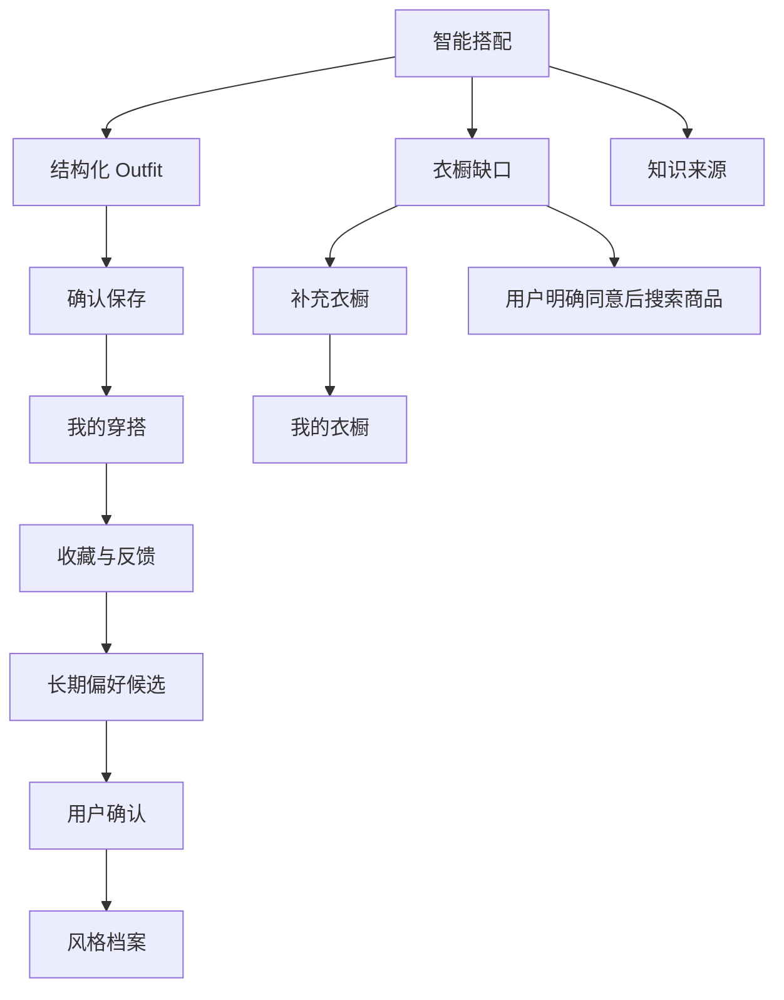

# Fashion-Agent 前端界面技术方案

## 1. 文档信息

- 项目名称：Fashion-Agent
- 文档类型：前端架构、界面与接口接入规范
- 文档状态：第一版设计
- 更新日期：2026-08-03
- 适用范围：Web MVP 与后续响应式 PWA

本文档用于指导 Fashion-Agent 前端项目的技术选型、页面设计、状态管理、
API 接入、测试和安全实现。前端必须遵守
[产品定位与范围](./product_scope.md)、[需求规格](./requirements.md)和
[后端架构](./architecture.md)中已经确认的数据边界。

具体视觉、布局、组件和交互规范见 [Web UI 设计方案](./ui-design.md)。

本文档只描述技术方案，不代表前端依赖已经安装，也不创建前端业务代码。

---

## 2. 前端目标与边界

Fashion-Agent 前端应帮助用户完成以下核心任务：

1. 用自然语言描述穿搭需求并继续多轮对话；
2. 查看结构化 Outfit、衣橱缺口、风险提示和知识来源；
3. 管理已有衣物及其当前可用状态；
4. 保存、收藏和反馈穿搭方案；
5. 查看和维护长期穿搭偏好；
6. 明确区分已有衣物、通用建议和真实商品来源。

前端不是电商商城，不负责支付、下单、物流或售后。没有真实商品来源时，
不能把通用推荐渲染成可购买商品。

### 2.1 设计原则

- 穿搭决策优先于商品陈列；
- 先展示结论，再允许用户展开理由和知识来源；
- 默认优先展示用户已有衣物；
- 对缺失、失败和不确定状态进行诚实表达；
- 破坏性操作必须二次确认，并提供清晰的影响说明；
- 移动端优先，同时支持桌面端高效管理衣橱；
- 不依赖颜色单独表达状态，保证键盘和辅助技术可访问。

---

## 3. 推荐技术栈

第一版建议使用独立的 TypeScript Web 应用，并放在项目根目录未来的
`frontend/` 中，与 Python 后端保持清晰边界。

| 领域 | 推荐技术 | 作用 |
|---|---|---|
| 构建工具 | Vite | 适合独立 FastAPI 后端的轻量 SPA 构建与开发代理 |
| UI 框架 | React + TypeScript | 组件化界面和严格接口类型 |
| 路由 | React Router | 页面路由、嵌套路由和错误边界 |
| 服务端状态 | TanStack Query | API 缓存、失效、重试和请求状态 |
| 本地交互状态 | Zustand 或 React Context | 当前会话、界面偏好和跨组件临时状态 |
| 表单 | React Hook Form + Zod | 表单状态、前端校验和错误映射 |
| 样式 | Tailwind CSS + 可访问组件库 | 响应式布局和统一设计 Token |
| 单元测试 | Vitest + Testing Library | 组件、Hook 和交互测试 |
| API Mock | MSW | 在不启动 FastAPI 和不调用模型时模拟接口 |
| 端到端测试 | Playwright | 核心用户流程与多视口验证 |
| 接口类型 | OpenAPI 类型生成 | 从 FastAPI OpenAPI 生成类型，减少手写漂移 |

不建议在第一版引入 SSR。当前产品的大部分页面都依赖用户身份和动态数据，
使用 SPA 更简单。将来出现公开分享页、SEO 或服务端渲染需求时，再评估 Next.js。

所有依赖的具体版本应在创建前端项目时统一确认并锁定；安装依赖前仍需得到
用户许可。

---

## 4. 部署与通信方式

### 4.1 推荐方式：同源部署

生产环境建议由反向代理统一提供域名：

```text
https://fashion.example.com/          → 前端静态资源
https://fashion.example.com/api/v1/*  → FastAPI
```

同源部署可以降低 CORS、Cookie、安全头和环境配置复杂度。

### 4.2 本地开发

前端开发服务器使用 `/api` 代理到 FastAPI：

```text
浏览器 → http://localhost:5173/api/v1/*
Vite Proxy → http://127.0.0.1:8000/api/v1/*
```

当前 FastAPI 没有配置通用 CORS 中间件，因此不建议让浏览器直接从 5173 端口
跨域访问 8000 端口。若未来确实需要跨域，应在后端使用严格域名白名单，不能设置
允许任意来源并同时携带凭据。

### 4.3 前端环境变量

建议只暴露非敏感构建配置，例如：

```text
VITE_API_BASE_URL=/api/v1
VITE_APP_NAME=Fashion-Agent
VITE_ENABLE_WARDROBE_VISION=false
```

API Key、数据库地址、Redis 地址、模型密钥和服务端 Token 不能进入前端环境变量、
构建产物或浏览器存储。

---

## 5. 信息架构

### 5.1 一级导航

| 路由 | 页面 | 核心任务 |
|---|---|---|
| `/` | 智能搭配 | 与 Agent 对话并查看本轮 Outfit |
| `/wardrobe` | 我的衣橱 | 浏览、筛选、新增和维护衣物 |
| `/outfits` | 我的穿搭 | 查看保存、收藏和反馈过的 Outfit |
| `/profile` | 风格档案 | 维护明确偏好并确认偏好候选 |
| `/settings` | 设置与隐私 | 会话、数据、可访问性和隐私说明 |

移动端使用底部导航，建议只放“搭配、衣橱、穿搭、我的”四项；设置和长期偏好
作为“我的”的二级入口。桌面端使用左侧导航和右侧主内容区。

### 5.2 页面关系



---

## 6. 页面与核心组件

### 6.1 智能搭配页

页面组成：

- `ConversationHeader`：会话标题、新建会话、结束会话；
- `MessageList`：用户消息、Agent 消息和请求状态；
- `PromptComposer`：文本输入、天气上下文入口、发送按钮；
- `OutfitRecommendationCard`：本轮结构化 Outfit；
- `OutfitGapCard`：候选不足时的缺口和允许的下一步；
- `OutfitIssueList`：风险、警告和阻断原因；
- `KnowledgeSources`：折叠展示本次命中的知识来源；
- `SaveOutfitAction`：确认保存当前会话最后一套结构化 Outfit。

当前聊天接口不是流式接口。用户点击发送后，应显示“正在分析衣橱、天气和知识”
等中性加载状态，直到整个响应返回。前端取消等待不等于服务端模型调用已经取消，
界面不能提示“服务端已终止”。

#### ChatResponse 渲染优先级

1. 始终显示 `message`；
2. `outfit` 非空时展示完整结构化 Outfit；
3. `outfit_gap` 非空时展示缺失角色和下一步；
4. `outfit_issues` 中 `error` 使用阻断样式，`warning` 使用提醒样式；
5. `sources` 非空时提供“查看知识依据”；
6. 不应只依赖 Agent 文本解析结构化字段。

`OutfitItem.source` 的展示规则：

| 值 | 前端标签 | 交互 |
|---|---|---|
| `wardrobe` | 我的衣橱 | 可进入对应衣橱详情 |
| `product` | 外部商品 | 只有存在已验证外部链接时才提供跳转 |
| `recommendation` | 建议单品 | 不显示购买按钮，不伪装成真实库存 |

### 6.2 我的衣橱页

页面组成：

- 图片或紧凑列表视图；
- 品类筛选；
- `available` / `unavailable` 状态筛选；
- 分页或“加载更多”；
- 新增衣物抽屉；
- 衣物详情与编辑页；
- 快速可用状态切换；
- 删除确认对话框。

衣物状态只保留两个领域值：

- `available`：可以参与穿搭；
- `unavailable`：待洗、清洗中、未干、损坏或暂时找不到等统一视为不可用。

界面可以让用户填写不可用原因，但不能把原因自创为新的后端状态枚举。

### 6.3 图片识别录入

图片识别必须是“两阶段确认”流程：

```text
选择图片
→ 客户端检查格式和大小
→ 生成本地预览
→ 调用识别接口
→ 展示 WardrobeItemDraft
→ 用户修正并确认
→ 调用新增衣橱接口
```

识别草稿不是衣橱事实，不能在收到识别响应后自动保存。前端应突出显示
`uncertain_fields`、`missing_fields` 和 `unrecognizable_fields`。

Base64 只用于当前接口传输，不应写入 Local Storage、日志、埋点或错误报告。

### 6.4 我的穿搭页

支持：

- 场景筛选；
- 仅查看收藏；
- 分页；
- Outfit 详情；
- 收藏或取消收藏；
- 喜欢、不喜欢或文字反馈；
- 删除反馈。

当前后端没有删除已保存 Outfit 的接口，因此前端第一版不能展示“删除 Outfit”
按钮。反馈可以覆盖更新，但态度和文字说明至少需要提供一项。

### 6.5 风格档案页

建议分为三个区域：

1. 明确偏好：风格、颜色、版型、避免材质、常见场景和典型预算；
2. 待确认候选：由重复反馈产生，只在用户点击确认后进入长期档案；
3. 偏好来源：查看来源、证据、确认时间、过期时间，并允许删除。

前端必须区分：

- 用户明确编辑的档案；
- 系统从反馈中分析出的候选；
- 已确认且具有来源记录的长期偏好。

候选不能自动确认。喜欢与避免列表存在冲突时，应在提交前就地提示，同时仍以
服务端校验结果为最终依据。

---

## 7. 前端目录建议

```text
frontend/
├── public/
├── src/
│   ├── app/                    # 应用入口、Provider 和全局错误边界
│   ├── routes/                 # 路由声明与页面级懒加载
│   ├── pages/
│   │   ├── chat/
│   │   ├── wardrobe/
│   │   ├── outfits/
│   │   ├── profile/
│   │   └── settings/
│   ├── features/               # 按业务能力组织组件和 Hook
│   │   ├── conversation/
│   │   ├── outfit/
│   │   ├── wardrobe/
│   │   ├── style-profile/
│   │   └── feedback/
│   ├── components/
│   │   ├── ui/                 # 无业务含义的基础组件
│   │   └── layout/
│   ├── api/
│   │   ├── client.ts           # Base URL、请求头和错误归一化
│   │   ├── generated/           # 从 OpenAPI 生成的类型
│   │   └── queries/             # Query Key、查询和 Mutation
│   ├── stores/                 # 少量客户端状态
│   ├── hooks/
│   ├── lib/                    # 日期、金额、文件和安全工具
│   ├── styles/                 # Token 与全局样式
│   ├── test/                   # MSW、fixture 和测试初始化
│   └── main.tsx
├── e2e/
├── .env.example
├── package.json
├── tsconfig.json
└── vite.config.ts
```

业务数据不应复制进多个全局 Store。服务端数据交给 TanStack Query，Zustand 只保存
当前会话 ID、未发送草稿和纯界面状态。

---

## 8. API 接入规范

### 8.1 基础约定

- Base URL：`/api/v1`；
- JSON 请求使用 `Content-Type: application/json`；
- 开发和测试环境暂时通过 `X-User-ID` 传递用户身份；
- 生产环境禁止信任浏览器直接提供的 `X-User-ID`；
- 后端响应包含 `X-Request-ID` 时，前端错误页应允许用户复制该 ID；
- 删除接口成功通常返回 `204 No Content`，客户端不能继续解析 JSON；
- 日期使用 ISO 8601；带时间的字段必须包含时区；
- 金额响应当前可能是两位小数字符串，前端不能使用二进制浮点进行金额运算。

生产身份认证尚未实现。前端正式上线前，必须将开发身份请求头替换为可信认证会话，
不能把固定 `X-User-ID` 当成生产登录方案。

### 8.2 当前接口矩阵

| 方法 | 路径 | 前端用途 |
|---|---|---|
| GET | `/health` | 进程存活检查 |
| GET | `/health/ready` | PostgreSQL 与短期记忆就绪检查 |
| POST | `/chat` | 发送对话并取得文本、Outfit、缺口和来源 |
| DELETE | `/chat/{conversation_id}` | 幂等结束当前用户会话 |
| GET | `/wardrobe` | 衣橱分页、品类和状态筛选 |
| POST | `/wardrobe` | 新增衣橱单品 |
| POST | `/wardrobe/recognitions` | 图片识别并返回待确认草稿 |
| GET | `/wardrobe/{wardrobe_item_id}` | 衣物详情 |
| PATCH | `/wardrobe/{wardrobe_item_id}` | 局部修改衣物 |
| PATCH | `/wardrobe/{wardrobe_item_id}/status` | 快速切换可用状态 |
| DELETE | `/wardrobe/{wardrobe_item_id}` | 删除衣物 |
| POST | `/outfits` | 保存指定会话最后一套结构化 Outfit |
| GET | `/outfits` | 已保存 Outfit 分页与筛选 |
| GET | `/outfits/feedback/recent` | 最近反馈列表 |
| GET | `/outfits/{outfit_id}` | Outfit 详情 |
| PATCH | `/outfits/{outfit_id}/favorite` | 修改收藏状态 |
| PUT | `/outfits/{outfit_id}/feedback` | 新增或覆盖反馈 |
| GET | `/outfits/{outfit_id}/feedback` | 查询反馈 |
| DELETE | `/outfits/{outfit_id}/feedback` | 删除反馈 |
| GET | `/style-profile` | 查询长期档案 |
| PUT | `/style-profile` | 完整替换长期档案 |
| PATCH | `/style-profile` | 局部修改长期档案 |
| DELETE | `/style-profile` | 删除档案及关联偏好来源 |
| GET | `/style-profile/candidates` | 查询动态偏好候选 |
| POST | `/style-profile/candidates/confirm` | 用户确认候选 |
| GET | `/style-profile/memories` | 查询偏好来源和有效期 |
| PATCH | `/style-profile/memories/{id}` | 设置或清除过期时间 |
| DELETE | `/style-profile/memories/{id}` | 删除单条长期偏好 |

接口的最终事实来源是 FastAPI OpenAPI 文档。前端类型应从当前 OpenAPI 生成，
本表用于界面规划，不能替代自动契约校验。

### 8.3 Chat 请求状态

建议为一次消息发送维护以下状态：

```text
idle → submitting → success
                  ↘ error
```

同一会话默认只允许一个发送请求在途，避免回复顺序与 Checkpointer 状态错乱。
切换页面时可以保持请求，但不能对同一 `conversation_id` 并发提交多条消息。

首次请求不传 `conversation_id`，成功后保存服务端返回的 ID。建议按当前用户把
活动会话 ID 放在 Session Storage，而不是长期 Local Storage；退出登录或显式结束
会话时清除。聊天正文不进入浏览器持久缓存。

### 8.4 错误归一化

前端 API Client 应把错误统一转换为：

```ts
type AppError = {
  status: number | null;
  code: string;
  message: string;
  requestId?: string;
  fieldErrors?: Record<string, string[]>;
  retryable: boolean;
};
```

需要覆盖：

- 项目 `ErrorResponse`：`code + message`；
- FastAPI/Pydantic 的 422 字段错误；
- 401/403 身份和权限错误；
- 404 资源不存在；
- 409 档案或偏好冲突；
- 503 数据库、Redis、模型或 Provider 未就绪；
- 超时、断网和无法解析的响应。

只有幂等 GET 可以有限自动重试。聊天发送、保存 Outfit、新增衣物和修改档案默认
不自动重试，避免重复副作用；应由用户明确点击重试。

---

## 9. 状态管理与缓存

### 9.1 Query Key 建议

```text
['wardrobe', filters]
['wardrobe-item', wardrobeItemId]
['outfits', filters]
['outfit', outfitId]
['outfit-feedback', outfitId]
['recent-feedback', filters]
['style-profile']
['preference-candidates', minimumEvidence]
['preference-memories', includeExpired]
```

用户身份变化时必须清空全部用户级 Query Cache，避免不同用户在同一浏览器中看到
上一位用户的数据。

### 9.2 Mutation 失效规则

| 操作 | 成功后失效或更新 |
|---|---|
| 新增/修改/删除衣物 | 衣橱列表与对应详情 |
| 切换衣物状态 | 衣橱列表、详情；后续对话自然使用新状态 |
| 保存 Outfit | Outfit 列表；可直接写入详情缓存 |
| 收藏 Outfit | Outfit 列表和详情 |
| 提交/删除反馈 | Outfit 反馈、最近反馈、偏好候选 |
| 确认偏好候选 | 风格档案、候选、偏好来源 |
| 修改/删除偏好来源 | 风格档案、偏好来源、候选 |
| 删除风格档案 | 风格档案、候选和偏好来源 |

聊天消息第一版可以保存在页面内存中。Redis 保存的是 Agent 短期状态，不等同于
前端可查询的完整聊天记录；当前后端也没有会话列表和历史消息查询 API。

---

## 10. 视觉与响应式规范

### 10.1 视觉方向

- 气质：清爽、年轻、可信，避免过度电商化；
- 内容层级：方案名称 > 单品组合 > 推荐理由 > 来源和技术信息；
- Outfit 卡片应突出“可直接执行”，商品卡片不能抢占主视觉；
- 衣橱来源、商品来源、通用建议使用不同图标和文字标签；
- 风险和缺口使用明确说明，不只显示红色感叹号。

### 10.2 响应式断点原则

- 小屏：单列、底部导航、表单全屏抽屉；
- 中屏：单列内容加可收起筛选栏；
- 大屏：导航 + 主内容 + 可选上下文侧栏；
- 聊天正文设置可读最大宽度，不随屏幕无限拉伸；
- Outfit 单品在手机上纵向排列，在桌面端使用自适应网格。

### 10.3 设计 Token

至少统一：

- 品牌色、中性色、成功、警告、危险和信息色；
- 4/8 像素间距体系；
- 圆角、阴影和边框层级；
- 标题、正文、辅助文字和数字样式；
- 移动端和桌面端内容最大宽度；
- 动画时长，并支持 `prefers-reduced-motion`。

---

## 11. 可访问性

第一版目标至少达到 WCAG 2.2 AA 的核心要求：

- 所有操作支持键盘；
- 焦点样式清晰，弹窗关闭后焦点返回触发按钮；
- 表单错误与具体字段关联；
- 加载结果通过 `aria-live` 适度通知，但不逐字朗读长回复；
- 图标按钮提供可访问名称；
- 衣物图片具有用户可理解的替代文本；
- 文本和背景保持足够对比度；
- 状态不只依赖颜色；
- 触控目标适合移动设备；
- 尊重系统减少动画设置。

---

## 12. 安全与隐私

- 不在前端保存模型、数据库或第三方 Provider 密钥；
- 不把聊天正文、衣橱照片、尺码和偏好发送给非必要分析服务；
- 不在控制台、埋点和错误上报中记录完整请求体；
- Agent 文本默认按纯文本渲染；若支持 Markdown，必须使用严格白名单清洗 HTML；
- 外部链接使用安全协议并明确来源平台，必要时添加 `noopener noreferrer`；
- 文件上传前验证 MIME、文件头、大小和图片维度；
- 退出登录后清理会话 ID、Query Cache、图片预览和未提交敏感草稿；
- 破坏性删除必须说明影响范围；
- 不把 `X-User-ID` 开发方案带入生产；
- CSP、HSTS、Referrer Policy 等安全头应由生产反向代理统一配置。

---

## 13. 前端可观测性

前端第一版只记录不含业务正文的技术事件：

- 页面和接口名称；
- 请求耗时、状态码和稳定错误码；
- `X-Request-ID`；
- 是否出现 Outfit、缺口或错误；
- 客户端版本和浏览器能力。

不得记录 Prompt、Agent 完整回复、衣橱内容、风格档案、图片 Base64、用户 ID、
会话 ID或外部购买链接。需要接入 Sentry、OpenTelemetry Web 或分析平台时，必须
先完成脱敏、采样和数据保留评审。

---

## 14. 测试策略

### 14.1 单元和组件测试

重点覆盖：

- Outfit 三种来源标签；
- Outfit、Gap 和 Issue 的条件渲染；
- 422 字段错误映射；
- 衣物状态切换；
- 图片识别草稿必须确认；
- 喜欢与避免项冲突；
- 删除确认；
- 204 响应处理；
- 身份变化后缓存清理；
- 敏感正文不进入日志。

### 14.2 MSW 契约场景

- 首次聊天生成 `conversation_id`；
- 后续消息复用相同会话；
- 完整 Outfit；
- 衣橱候选不足返回 `outfit_gap`；
- RAG 返回多个来源；
- 数据库或 Redis 返回 503；
- 模型超时；
- 保存 Outfit 时会话中没有可保存推荐；
- 衣橱 404 和档案 409；
- 图片识别低置信度。

### 14.3 Playwright 核心流程

1. 发送穿搭需求并查看 Outfit；
2. 保存 Outfit、收藏并提交反馈；
3. 新增衣物、切为不可用并确认不再作为可用项展示；
4. 图片识别、修正草稿并确认入库；
5. 编辑长期档案并确认偏好候选；
6. 删除会话并创建新会话；
7. 在手机和桌面视口完成主要操作；
8. 使用键盘完成聊天、衣橱编辑和反馈。

前端 CI 应使用 Mock API 完成默认测试，不调用真实 LLM、不下载模型，也不要求
PostgreSQL、Redis 或 Chroma。真实端到端测试作为显式质量门单独运行。

---

## 15. 分阶段实施计划

### 阶段 F0：工程基础

- 创建 `frontend/` 独立工程；
- 配置 TypeScript、路由、样式和测试；
- 建立 Vite `/api` 代理；
- 从 FastAPI OpenAPI 生成接口类型；
- 建立 API Client、错误归一化和 MSW；
- 建立桌面与移动端应用外壳。

### 阶段 F1：核心穿搭闭环

- 智能搭配页；
- 多轮会话 ID 管理；
- Outfit、Gap、Issue 和来源展示；
- 保存 Outfit；
- 全局错误、空状态和加载状态。

### 阶段 F2：衣橱与穿搭管理

- 衣橱列表、筛选、分页、详情和编辑；
- 可用状态快速切换；
- 已保存 Outfit 列表、收藏和反馈；
- 响应式布局与基础可访问性验证。

### 阶段 F3：个性化

- 风格档案编辑；
- 偏好候选确认；
- 偏好来源、过期和删除；
- 图片识别草稿确认流程。

### 阶段 F4：上线准备

- 接入正式身份认证；
- 完善安全头、审计和隐私说明；
- Playwright 真实环境测试；
- 性能、可访问性和弱网测试；
- 评估 PWA、流式聊天和前端遥测。

---

## 16. 当前后端限制与前端处理

| 当前限制 | 前端处理 |
|---|---|
| 聊天不是流式响应 | 使用明确的整体加载状态，不模拟虚假逐字输出 |
| 没有会话列表和消息历史 API | 只维护当前页面会话，不承诺跨设备聊天记录 |
| 生产身份认证未实现 | 仅在开发环境使用 `X-User-ID`，禁止生产上线 |
| 没有删除已保存 Outfit 的接口 | 不展示删除 Outfit 操作 |
| 没有独立商品浏览 API | 商品只通过 Agent 当前结果展示，不构建商城页 |
| 图片由 Base64 识别 | 限制大小、禁止持久缓存、识别后必须确认 |
| 没有前端专用天气接口 | 天气由用户输入、客户端已授权来源或 Agent Tool 提供 |
| Collector 和前端遥测未部署 | 先使用 `X-Request-ID` 协助诊断 |

---

## 17. 第一版验收标准

1. 用户能在手机和桌面浏览器完成一次多轮穿搭对话；
2. 页面能分别展示文本回复、结构化 Outfit、衣橱缺口、风险和知识来源；
3. 用户能新增、修改、筛选、切换状态和删除自己的衣物；
4. 用户能保存、收藏和反馈 Outfit；
5. 用户能维护明确长期偏好，并手动确认系统候选；
6. 前端不虚构商品链接、价格、库存或用户拥有的衣物；
7. 服务端错误能显示稳定提示和可复制的 `request_id`；
8. 用户级缓存不会跨身份复用；
9. 默认测试不调用真实 LLM、数据库或外部网络；
10. 核心流程满足键盘操作、对比度和表单错误提示要求。

---

## 18. 开发前仍需确认的决策

正式开始写前端代码前，需要确认：

1. 第一版是否确定使用 React + TypeScript + Vite；
2. UI 组件库和视觉风格；
3. 正式身份认证方案；
4. 前端是否与 FastAPI 同源部署；
5. 图片的正式存储与访问方式；
6. 是否需要流式聊天；
7. 是否把 PWA 和离线能力纳入第一版；
8. 是否需要公开 Outfit 分享页。

在这些决策确认以前，可以先完成界面原型、OpenAPI 契约、Mock 数据和组件测试，
但不能把开发身份头、样例商品或本地图片地址当作正式生产方案。
